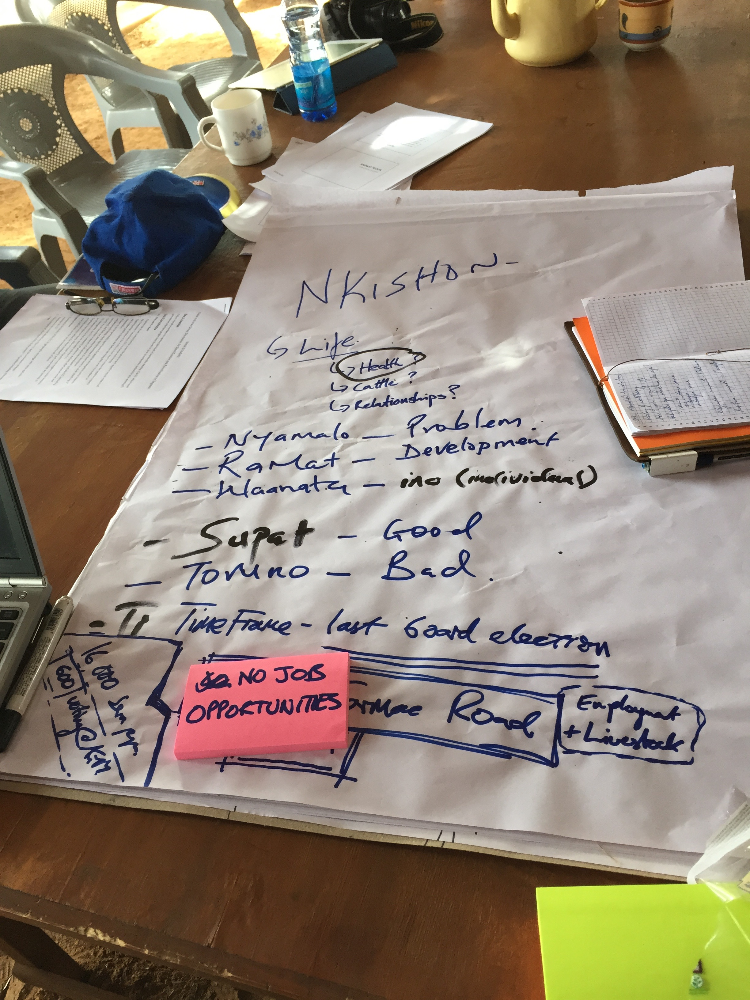

## Community Conservancies

**Lands that are collectively owned and managed by the resident indigenous communities are being set aside for wildlife conservation and sustainable livestock practices.**

The Need
>  - Frequent Drought
>  - Sparse Government Services
>  - Degraded Rangelands and Poor Livestock Production
>  - Security Issues
>   - Cattle Rustling
>   - Ivory Poaching
>   - Ethnic rivalries
  
**Peace and Security Needed for Livelihood Development, Protection of Wildlife and Growth of the Region.**

--- &carousel

## Management Hierachies

*** {class: active, img: "assets/img/nrtorgan.jpg"}
NRT Organgram

*** {img: "assets/img/Slide1.tiff"}
Conservancy Organogram


---  &twocol_eq

## Overview of NRT Governance Scores
***=left
NRT Governance Scores are:

- Modular
 - 15 Parameters
 - Sub-parameters
 
- Qualitative
 - Score: Subjective
 - Range: 0-2
 
- Annual
- Report Cards
- Adaptive Management

***=right
**Community Feedback**

- Social COMMS
 - Collect annually?
 - Need to integrate into score?
 - Unbiased
 
- Map neglected areas
- "Benefit" assessment
- "Impact" asessment

--- &tocol_rev

## Governance Scores: 2012-2014
*** =left
```{r gov_score_graph, echo=FALSE, comment=FALSE, warning=FALSE, cache=TRUE}
setwd("~/Documents/NRT/scomms/Github/governance_ppt")
nrt_red <- rgb(160,15,15,max=255)
nrt_green1 <- rgb(80,120,20,max=255)
nrt_yellow <- rgb(190,235,0,max=255)
wh <- rgb(255,255,255,max=255)
nrt_black <- rgb(0,0,0,max=255)
nrt_brown <- rgb(135,90,40,max=255)
nrt_green2 <- rgb(110,105,0,max=255)
nrt_red1 <- rgb(155,20,0,max=255)
nrt_blue <- rgb(0,80,160,max=255)
library(ggplot2)
library(XLConnect)

gov <- loadWorkbook("~/Documents/NRT/scomms/Github/governance_ppt/slides/gov_scores.xlsx")
gov1 <- readWorksheet(gov, 1)
library(reshape)
gov2 <- reshape(gov1,
                varying=c("registration",
                          "agm",
                          "community_support",
                          "board_rotation",
                          "hr_procedures",
                          "annual_audit",
                          "budget_process",
                          "budget_execution",
                          "revenue_sharing_bylaws",
                          "revenue_publication",
                          "quarterly_reporting",
                          "fundraising",
                          "donor_relations",
                          "asset_management",
                          "partnerships",
                          "performance_score"),
                v.names="gov_score",
                timevar="gov_parameter",
                times=c("registration",
                        "agm",
                        "community_support",
                        "board_rotation",
                        "hr_procedures",
                        "annual_audit",
                        "budget_process",
                        "budget_execution",
                        "revenue_sharing_bylaws",
                        "revenue_publication",
                        "quarterly_reporting",
                        "fundraising",
                        "donor_relations",
                        "asset_management",
                        "partnerships",
                        "performance_score"),
                direction="long")


library(data.table) # For below setnames command
setnames(gov2, "conservancy", "name")

# Subsets for only performance_score
gov3 <- subset(gov2, gov_parameter == "performance_score")
gov3$ccy <- as.factor(gov3$name)
gov3$score <- as.numeric(gov3$gov_score)
gov3 <- gov3[order(-gov3$gov_score),]
gov3$rank <- seq(1:length(gov3$gov_score))
gov3 <- gov3[order(gov3$ccy),]
gov3$ccy1 <- factor(gov3$ccy, levels=gov3$ccy[order(gov3$rank)])
gov3$year <- as.factor(gov3$year)

p1 <- ggplot(gov3,aes(x=ccy, y=gov_score, fill=year)) 
p1 <- p1 + geom_bar(stat="identity", width=0.5) 
p1 <- p1 + facet_wrap(~year, nrow=3)
p1 <- p1 +  xlab("Conservancy") + ylab("Governance Score")
#p1 <- p1 +  ggtitle("Governance Score\n")
p1 <- p1 + theme(plot.title = element_text(size = 24))
p1 <- p1 +  scale_fill_brewer(palette="Reds")
p1 <- p1 + theme_bw() 
p1 <- p1 +  theme(panel.border = element_blank(), 
    panel.grid.major = element_blank(), 
    panel.grid.minor = element_blank(), 
    axis.line = element_line(colour = "grey",lineend="butt",size=2))
p1 <- p1 + theme(axis.title.y=element_text(vjust=1.5,family="", size=12, face="bold")) 
p1 <- p1 + theme(axis.title.x=element_text(vjust=1.5,family="", size=12, face="bold")) 
p1 <- p1 +  theme(axis.text=element_text(family="", size=10, face="bold"))
p1 <- p1 + theme(axis.text.x = element_text(angle=90, vjust=0.4, hjust=1, size=10)) 
p1 <- p1  + theme(legend.title=element_blank())
p1 <- p1 +  theme(legend.text=element_text(size=10))
#p1 <- p1 +  theme(legend.position=c(0.85, 0.3))
p1 <- p1 +  scale_y_continuous(expand=c(0,0))
```

```{r gov_score_graph1, echo=FALSE, fig.height=9, fig.width=12}
p1
```

***=right
**Average Annual Governance Scores**

```{r annual_avg_gov_score, echo=FALSE}
gov2 <- reshape(gov1,
                varying=c("registration",
                          "agm",
                          "community_support",
                          "board_rotation",
                          "hr_procedures",
                          "annual_audit",
                          "budget_process",
                          "budget_execution",
                          "revenue_sharing_bylaws",
                          "revenue_publication",
                          "quarterly_reporting",
                          "fundraising",
                          "donor_relations",
                          "asset_management",
                          "partnerships",
                          "performance_score"),
                v.names="gov_score",
                timevar="gov_parameter",
                times=c("registration",
                        "agm",
                        "community_support",
                        "board_rotation",
                        "hr_procedures",
                        "annual_audit",
                        "budget_process",
                        "budget_execution",
                        "revenue_sharing_bylaws",
                        "revenue_publication",
                        "quarterly_reporting",
                        "fundraising",
                        "donor_relations",
                        "asset_management",
                        "partnerships",
                        "performance_score"),
                direction="long")
library(data.table) # For below setnames command
setnames(gov2, "conservancy", "name")

# Subsets for only performance_score
gov3 <- subset(gov2, gov_parameter == "performance_score")

t1 <- round(aggregate(gov_score ~ year, gov3, mean),2)
colnames(t1) <- c("Year", "Average Score")
```

```{r annual_avg_score_chart, echo=FALSE, results='asis'}
library(xtable)
t1 <- data.table(t1)
print(xtable(t1), type="html",comment=F)
#str(t1)
#t1
```

--- #myslide


<div>
<iframe src="https://dgohil.shinyapps.io/app2/", width=500, height=600></iframe>
</div>


--- 
## Choroplethic Governance Map
```{r choroplethic_map, echo=FALSE, message=FALSE, comment=FALSE, warning=FALSE, cache=F}
# Get data
library(plyr)
library(XLConnect)
gov <- loadWorkbook("~/Documents/NRT/scomms/Github/governance_ppt/slides/gov_scores.xlsx")
gov1 <- readWorksheet(gov, 1)
# Do not convert data to factor. ichoropleth only recognizes numeric or character data

library(rgdal)
library(foreign) # To read the dbf file
# "GeoJSON" %in% ogrDrivers()$name
# ogrDrivers() checks whether the drivers are present

# The dbf from the state shapefile needed to merge with the df state_code and names
library(foreign)
codes <- read.dbf("states1.dbf")
#names(codes)
codes$NOM_ENT <- iconv(codes$NOM_ENT, "windows-1252", "utf-8")
codes$CVE_ENT <- as.numeric(codes$CVE_ENT)
codes$OID <- NULL
names(codes) <- c("state_code","area", "name", "pop","yr_reg","area_km")

# Replace all spaces in state names with "_" in the topojson file
library(stringr)
con <- file("ccy.json", "r") # get an incomplete final line error.
tpjson <- readLines(con)
close(con)
for(i in 1:19) {
  tpjson <- str_replace_all(tpjson, codes$name[i],
                            str_replace_all(codes$name[i], " ", "_"))
}

# Sum performance_score by conservancy,nrt_area etc and group by conservancy and nrt_area and year
# We first need make reshape the data to make it "long". This will allow us to crete dropdown menu to change
# the data that displays.

library(reshape)
gov2 <- reshape(gov1,
                varying=c("registration",
                          "agm",
                          "community_support",
                          "board_rotation",
                          "hr_procedures",
                          "annual_audit",
                          "budget_process",
                          "budget_execution",
                          "revenue_sharing_bylaws",
                          "revenue_publication",
                          "quarterly_reporting",
                          "fundraising",
                          "donor_relations",
                          "asset_management",
                          "partnerships",
                          "performance_score"),
                v.names="gov_score",
                timevar="gov_parameter",
                times=c("registration",
                        "agm",
                        "community_support",
                        "board_rotation",
                        "hr_procedures",
                        "annual_audit",
                        "budget_process",
                        "budget_execution",
                        "revenue_sharing_bylaws",
                        "revenue_publication",
                        "quarterly_reporting",
                        "fundraising",
                        "donor_relations",
                        "asset_management",
                        "partnerships",
                        "performance_score"),
                direction="long")


library(data.table) # For below setnames command
setnames(gov2, "conservancy", "name")

# Subsets for only performance_score
gov3 <- subset(gov2, gov_parameter == "performance_score")

library(dplyr)
gov_all <- gov3 %>%
  filter(year %in% 2012:2014) %>% 
  group_by(nrt_area, name, year) %>%
  arrange(name)

# Names needed for the map
gov_final <- plyr::join(gov_all, codes)

# Cut the data into quantiles
gov_map <- transform(gov_all,
                     fillKey = cut(gov_score, breaks = 5, labels = LETTERS[1:5])
)


# Associate fill colors
library(RColorBrewer)
colourCount = 5
getPalette = colorRampPalette(brewer.pal(9, "Reds"))
my_cols <- rev(getPalette(colourCount)) # if you want to reverse palette
#my_cols <- getPalette(colourCount)
my_cols[6] <- c("#E5E5E5") # Greys out areas where there's no data

library(RColorBrewer)
fills = setNames(
  c(my_cols),
  c(levels(gov_map$fillKey), 'defaultFill')
)

gov_map1 <- plyr::dlply((gov_map), "year", function(x){
  y = rCharts::toJSONArray2(x, json = F)
  names(y) = lapply(y, '[[', 'name')
  return(y)
})

```

```{r map_setp, eval=FALSE,cache=F, message = F, echo=F, results = 'asis', comment = NA}
# Below code creates the animated choropleth map
library(rMaps)
options(RMAP_WIDTH = 600, RMAP_HEIGHT = 800)
knitr::opts_chunk$set(comment = NA, results = 'asis', tidy = F, message = F)
```

```{r ch1, cache=F, message = F, echo=F, results = 'asis', comment = NA, fig.height = 8, fig.width = 6}
d1 <- Datamaps$new()
d1$set(
  geographyConfig = list(
    dataUrl = "ccy.json",
    popupTemplate =  "#! function(geography, data) { //this function should just return a string
    return '<div class=hoverinfo><strong>' + geography.properties.name + '</strong></div>';
    }  !#"
  ),
  dom='chart_1',
  scope = 'states1',
  labels=TRUE,
  bodyattrs = "ng-app ng-controller=rChartsCtrl",  
  setProjection = '#! function( element, options ) {
  var projection, path;
  projection = d3.geo.mercator()
  .center([38.5, 1.3]) //centers the map on the conservancies
  .scale(10000) // makes it larger
  .translate([element.offsetWidth / 2, element.offsetHeight / 2]);
  
  path = d3.geo.path().projection( projection );
  
  return {path: path, projection: projection};
  
  } !#',
  fills = fills,
  data = gov_map1[[1]],
  legend = TRUE,
  labels = TRUE
)
d1$save('governance.html', cdn = TRUE)

d1$addAssets(
  jshead = "http://cdnjs.cloudflare.com/ajax/libs/angular.js/1.2.1/angular.min.js"
)
d1$setTemplate(chartDiv = "
               <div class='container'>
               <input id='slider' type='range' min=2012 max=2014 ng-model='year' width=200>
               <span ng-bind='year'></span>
               <div id = 'chart_1' class = 'rChart datamaps'>
               <script>
               function rChartsCtrl($scope){
               $scope.year = '2012';
               $scope.$watch('year', function(newYear){
               mapchart_1.updateChoropleth(chartParams.newData[newYear]);
               })
               }
               </script>
               </div>   "
)
d1$set(newData = gov_map1)
d1$save("governance.html", cdn = TRUE, standalone=TRUE)
#cat('<iframe src="governance.html" width=100%, height=600></iframe>')
#d1$show('inline')

```
```{r ch2, results = 'asis', comment = NA, message = F, echo = F}
#d1$show('inline')
d1$show('iframe', cdn = TRUE)
#<style>iframe{width:100%, height:400px;}</style>

```


--- #myslide2


<div>
<iframe src="https://dgohil.shinyapps.io/gov_scomms/", width=500, height=600></iframe>
</div>

--- &twocol

## Integration with Social COMMS
*** =right
- Importance
- Objectivity
- Survey Improvement
  - Support from Community
  - Transparency
  
  
  
**Build Strong Conservancies.**

*** =left



--- {
tpl: thankyou
}

## Thank You

For more information you can contact:

+254 702 788 055

deepali.gohil@nrt-kenya.org


